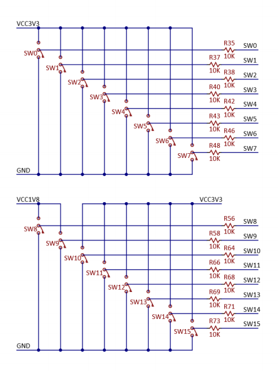
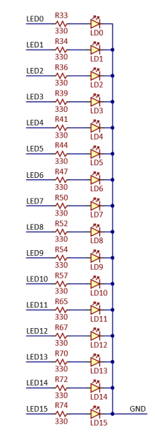
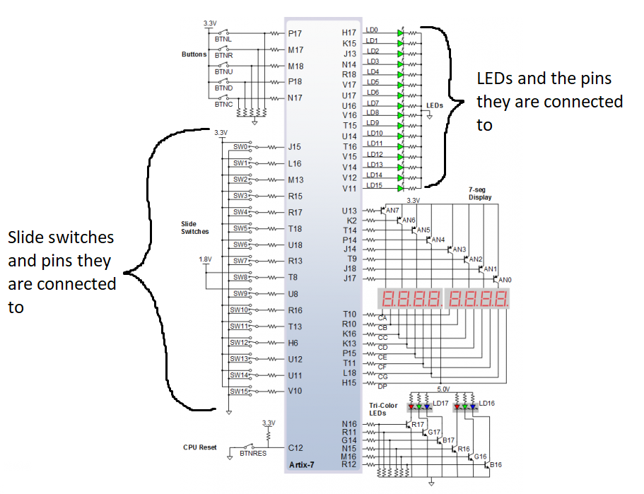
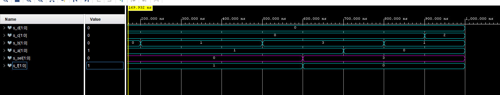

# Labs 3
## Vivado

GitHub link to my Digital-Electronics-1 repository

https://github.com/JiriKlimes99/Digital_Electronics_1.git


----------------------------------
## 1. Preparation Task

Connection of 16 slide switches and 16 LEDs on Nexys A7 board.

Connection paths of Slide switches



Connection paths of LEDs



Schematic of LEDs an swithes and pins they are connected to



----------------------------------
## 2. A 2-bit wide 4 to 1 multiplexer

### Listing of VHDL architecture from source file mux_2bit_4to1.vhd with syntax highlighting

```vhdl

architecture Behavioral of mux_2bit_4to1 is
begin
        f_o     <= a_i when (sel_i = "00") else
                   b_i when (sel_i = "01") else
                   c_i when (sel_i = "10") else
                   d_i;
                   
end architecture Behavioral;

```


### Listing of VHDL stimulus process from testbench file tb_mux_2bit_4to1.vhd with syntax highlighting

```vhdl

    p_stimulus : process
    begin
        -- Report a note at the begining of stimulus process
        report "Stimulus process started" severity note;

        s_a <= "00"; s_b <= "00"; s_c <= "00"; s_d <= "00";
        s_sel <= "00"; wait for 100 ns;
       
        s_a <= "01"; wait for 100 ns;
        s_b <= "01"; wait for 100 ns;
        
        s_sel <= "00"; wait for 100 ns;
        s_c <= "00"; wait for 100 ns;
        s_b <= "11"; wait for 100 ns;
        
        s_sel <= "11"; wait for 100 ns;
        s_a <= "00"; wait for 100 ns;
        s_b <= "01"; wait for 100 ns;
        s_c <= "10"; wait for 100 ns;
        s_d <= "11"; wait for 100 ns;
        s_sel <= "10"; wait for 100 ns;
        
        
        s_a <= "11"; wait for 100 ns;
        s_b <= "00"; wait for 100 ns;
        s_d <= "01"; wait for 100 ns;
        s_sel <= "01"; wait for 100 ns;

        -- Report a note at the end of stimulus process
        report "Stimulus process finished" severity note;
        wait;
    end process p_stimulus;

```


### Screenshot with simulated time waveforms




----------------------------------
## 3. A Vivado tutorial

Note: For existing projects: Quick Start -> Open Project -> Select dersired projects from list

### Creating new project
1)  For new projects: Quick Start -> Create Project
2)  Choose "Next"
3)  Choose name a write it in "Project name:" bar, optionally choose location for your project
4)  RTL project and next
5)  Create file (File type: VHDL) and name it
6)  Add constraints (optional)
7)  Select "Boards" and find board Nexys A7-50T, choose by clicking on it and select next
8)  Finish
9)  Optional - Add inputs

### Adding files (design sources. simulation sources, constraints)
1)  Click File -> Add sources
2)  Choose the desired part to add to your project
3)  "Create file" and choose sufficient name, File Type VHDL (test bench files name should be tb_name)


### Running simulation
1)  Use left menu and choose Simulation
2)  Run simulation
3)  Run behavioral simulation
4)  Optional - Relaunch simulation whenever needed using the Relaunch button on the top bar
