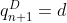
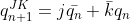
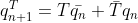
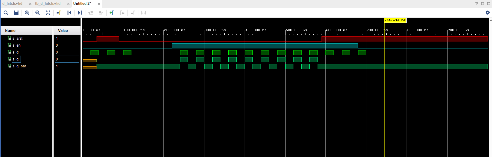
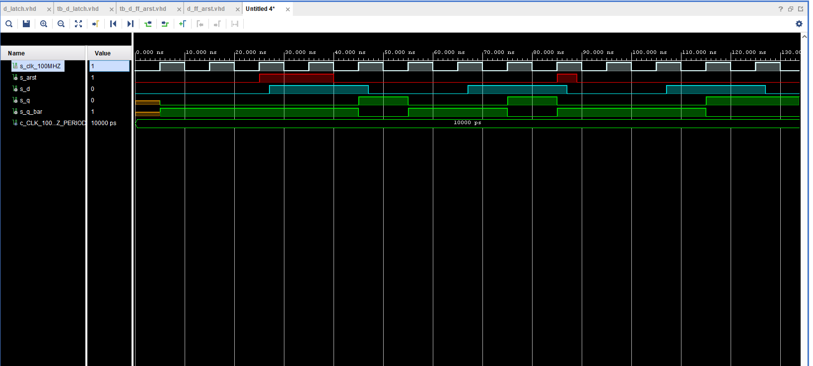
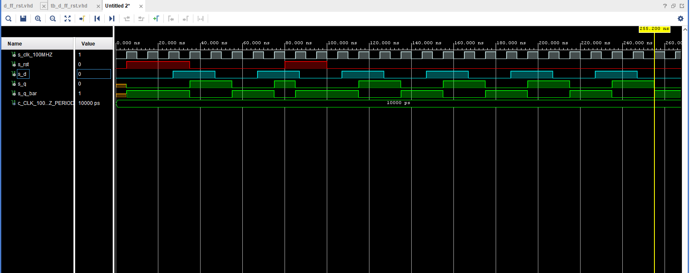
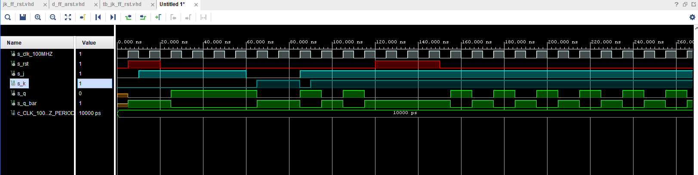
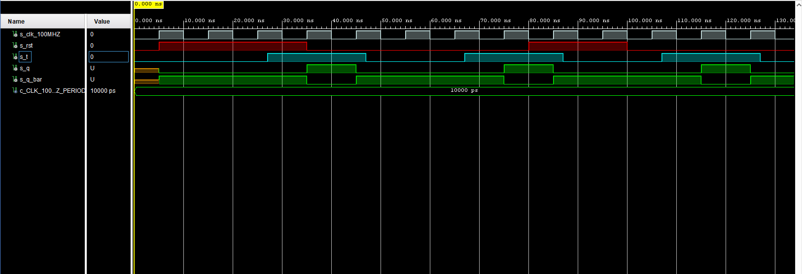
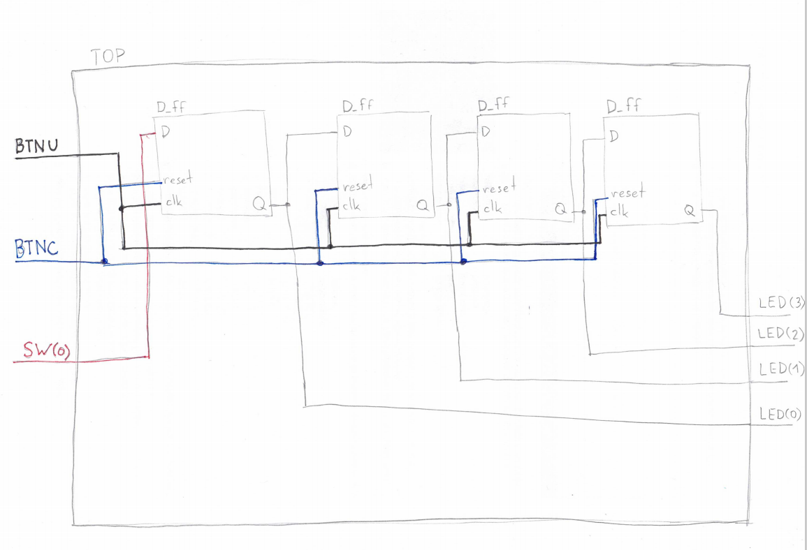

# Lab 7: 


GitHub link to my Digital-Electronics-1 repository

https://github.com/JiriKlimes99/Digital_Electronics_1.git

--------------------------------------------------


## Task 1 (Pre-Task)

Characteristic equations and completed tables for D, JK, T flip-flops.








<!--
\begin{align*}
    q_{n+1}^D =&~ \\
    q_{n+1}^{JK} =&\\
    q_{n+1}^T =&\\
\end{align*}-->

   | **clk** | **d** | **q(n)** | **q(n+1)** | **Comments** |
   | :-: | :-: | :-: | :-: | :-- |
   |  | 0 | 0 | 0 |  |
   |  | 0 | 1 | 0 |  |
   |  | 1 | 0 | 1 |  |
   |  | 1 | 1 | 1 |  |

   | **clk** | **j** | **k** | **q(n)** | **q(n+1)** | **Comments** |
   | :-: | :-: | :-: | :-: | :-: | :-- |
   |  | 0 | 0 | 0 | 0 |  |
   |  | 0 | 0 | 1 | 1 |  |
   |  | 0 | 1 | 0 | 0 |  |
   |  | 0 | 1 | 1 | 0 |  |
   |  | 1 | 0 | 0 | 1 |  |
   |  | 1 | 0 | 1 | 1 |  |
   |  | 1 | 1 | 0 | 1 |  |
   |  | 1 | 1 | 1 | 0 |  |

   | **clk** | **t** | **q(n)** | **q(n+1)** | **Comments** |
   | :-: | :-: | :-: | :-: | :-- |
   |  | 0 | 0 | 0 |  |
   |  | 0 | 1 | 1 |  |
   |  | 1 | 0 | 1 |  |
   |  | 1 | 1 | 0 |  |


<!--


## Task 2 - D latch

A) VHDL code listing of the process p_d_latch

```vhdl

    p_d_latch : process (d, arst, en)
    begin
        if (arst = '1') then
            q       <= '0';
            q_bar   <= '1';
        elsif (en = '1') then
            q       <= d;
            q_bar   <= not d;
        end if;
    end process p_d_latch;

```

B) VHDL code for reset and stimulus processes from the testbench tb_d_latch.vhd

```vhdl

p_reset_gen : process
    begin
        s_arst <= '0';
        wait for 35 ns;
        
        -- Reset activated
        s_arst <= '1';
        wait for 55 ns;

        -- Reset deactivated
        s_arst <= '0';

        wait for 500 ns;
        s_arst <= '1';
        
        wait;
    end process p_reset_gen;

```

```vhdl

 p_stimulus : process
    begin
        report "Stimulus process started" severity note;
        s_d     <= '0';
        s_en    <= '0';
        
        --d sekv
        wait for 20 ns;
        s_d     <= '1';
        wait for 20 ns;
        s_d     <= '0';
        wait for 20 ns;
        s_d     <= '1';
        wait for 20 ns;
        s_d     <= '0';
        wait for 20 ns;
        s_d     <= '1';
        wait for 20 ns;
        s_d     <= '0';
        --/d sekv
        
        wait for 100 ns;
        s_en    <= '1';
        
        
        --d sekv
        wait for 20 ns;
        s_d     <= '1';
        wait for 20 ns;
        s_d     <= '0';
        wait for 20 ns;
        s_d     <= '1';
        wait for 20 ns;
        s_d     <= '0';
        wait for 20 ns;
        s_d     <= '1';
        wait for 20 ns;
        s_d     <= '0';
        --/d sekv
        
        --d sekv
        wait for 20 ns;
        s_d     <= '1';
        wait for 20 ns;
        s_d     <= '0';
        wait for 20 ns;
        s_d     <= '1';
        wait for 20 ns;
        s_d     <= '0';
        wait for 20 ns;
        s_d     <= '1';
        wait for 20 ns;
        s_d     <= '0';
        --/d sekv
        
        --d sekv
        wait for 20 ns;
        s_d     <= '1';
        wait for 20 ns;
        s_d     <= '0';
        wait for 20 ns;
        s_d     <= '1';
        wait for 20 ns;
        s_d     <= '0';
        wait for 20 ns;
        s_d     <= '1';
        wait for 20 ns;
        s_d     <= '0';
        --/d sekv
        
        --d sekv
        wait for 20 ns;
        s_d     <= '1';
        wait for 20 ns;
        s_d     <= '0';
        wait for 20 ns;
        s_d     <= '1';
        wait for 20 ns;
        s_d     <= '0';
        wait for 20 ns;
        s_en    <= '0';      
        s_d     <= '1';
        wait for 20 ns;
        s_d     <= '0';
        --/d sekv
        
        
        report "Stimulus process finished" severity note;
        wait;
    end process p_stimulus;

```

C) Screenshot with simulated time waveforms; always display all inputs and outputs



--------------------------------------------------


## Task 3 - Flip-flops

A) VHDL code listing of the processes:

p_d_ff_arst

```vhdl

p_d_ff_arst : process (clk, arst)
    begin
        if (arst = '1') then
            q       <= '0';
            q_bar   <= '1';
        elsif rising_edge (clk) then
            q       <= d;  
            q_bar   <= not d;
        end if;
end process p_d_ff_arst;

```

p_d_ff_rst

```vhdl

p_d_ff_rst: process (clk)
    begin
    
    if rising_edge (clk) then
            if(rst = '1') then
                s_q <= '0';
            else 
                if(d = '0') then
                    s_q <= '0';
                elsif (d = '1') then
                    s_q <= '1';
                end if;
            end if;
        end if;
        
    end process p_d_ff_rst;

```

p_jk_ff_rst

```vhdl

p_jk_ff_rst : process (clk)
    begin
        if rising_edge (clk) then
            if(rst = '1') then
                s_q <= '0';
            else 
                if(j = '0' and k = '0') then
                    s_q <= s_q;
                elsif (j = '0' and k = '1') then
                    s_q <= '0';
                elsif (j = '1' and k = '0') then
                    s_q <= '1';
                elsif (j = '1' and k = '1') then
                    s_q <= not s_q;
                end if;
            end if;
        end if;

    end process p_jk_ff_rst;

```

p_t_ff_rst

```vhdl

p_t_ff_rst : process (clk)
    begin
    
    if rising_edge (clk) then
            if(rst = '1') then
                s_q <= '0';
            else 
                if(t = '0') then
                    s_q <= s_q;
                elsif(t = '1') then
                    s_q <= not s_q;
                end if;
            end if;
        end if;
        
    end process p_t_ff_rst;

```

B) Listing of VHDL clock, reset and stimulus processes from the testbench files


D Flip Flop Asynchronous
```vhdl

    --------------------------------------------------------------------
    -- Clock generation process
    --------------------------------------------------------------------
    p_clk_gen : process
    begin
        while now < 750 ns loop         -- 75 periods of 100MHz clock
            s_clk_100MHz <= '0';
            wait for c_CLK_100MHZ_PERIOD / 2;
            s_clk_100MHz <= '1';
            wait for c_CLK_100MHZ_PERIOD / 2;
        end loop;
        wait;
    end process p_clk_gen;
    
    --------------------------------------------------------------------
    -- Reset generation process
    --------------------------------------------------------------------
    --- WRITE YOUR CODE HERE
    p_reset_gen : process
    begin
        s_arst <= '0';
        wait for 25 ns;
        
        -- Reset activated
        s_arst <= '1';
        wait for 15 ns;

        -- Reset deactivated
        s_arst <= '0';
        
        wait for 45 ns;
        s_arst <= '1';
        wait for 20 ns;
        s_arst <= '0';

        wait for 500 ns;
        s_arst <= '1';
        
        wait;
    end process p_reset_gen;
    
    --------------------------------------------------------------------
    -- Data generation process
    --------------------------------------------------------------------
    --- WRITE YOUR CODE HERE
    p_stimulus : process
    begin
        report "Stimulus process started" severity note;
        
        s_d <= '0';
        
        --d sekv
        wait for 27 ns;
        s_d     <= '1';
        wait for 20 ns;
        s_d     <= '0';
        wait for 20 ns;
        s_d     <= '1';
        wait for 20 ns;
        s_d     <= '0';
        wait for 20 ns;
        s_d     <= '1';
        wait for 20 ns;
        s_d     <= '0';
        --/d sekv
        
        --d sekv
        wait for 20 ns;
        s_d     <= '1';
        wait for 20 ns;
        s_d     <= '0';
        wait for 20 ns;
        s_d     <= '1';
        wait for 20 ns;
        s_d     <= '0';
        wait for 20 ns;
        s_d     <= '1';
        wait for 20 ns;
        s_d     <= '0';
        --/d sekv
        
        report "Stimulus process finished" severity note;
        wait;
    end process p_stimulus;

```

D Flip Flop Synchronous
```vhdl

--------------------------------------------------------------------
    -- Clock generation process
    --------------------------------------------------------------------
    p_clk_gen : process
    begin
        while now < 750 ns loop         -- 75 periods of 100MHz clock
            s_clk_100MHz <= '0';
            wait for c_CLK_100MHZ_PERIOD / 2;
            s_clk_100MHz <= '1';
            wait for c_CLK_100MHZ_PERIOD / 2;
        end loop;
        wait;
    end process p_clk_gen;
    
    --------------------------------------------------------------------
    -- Reset generation process
    --------------------------------------------------------------------
    --- WRITE YOUR CODE HERE
    p_reset_gen : process
    begin
        s_rst <= '0';
        wait for 5 ns;
        
        -- Reset activated
        s_rst <= '1';
        wait for 30 ns;

        -- Reset deactivated
        s_rst <= '0';
        
        wait for 45 ns;
        s_rst <= '1';
        wait for 20 ns;
        s_rst <= '0';

        wait for 500 ns;
        s_rst <= '1';
        
        wait;
    end process p_reset_gen;
    
    --------------------------------------------------------------------
    -- Data generation process
    --------------------------------------------------------------------
    --- WRITE YOUR CODE HERE
    p_stimulus : process
    begin
        report "Stimulus process started" severity note;
        
        s_d <= '0';
        
        --d sekv
        wait for 27 ns;
        s_d     <= '1';
        wait for 20 ns;
        s_d     <= '0';
        wait for 20 ns;
        s_d     <= '1';
        wait for 20 ns;
        s_d     <= '0';
        wait for 20 ns;
        s_d     <= '1';
        wait for 20 ns;
        s_d     <= '0';
        --/d sekv
        
        --d sekv
        wait for 20 ns;
        s_d     <= '1';
        wait for 20 ns;
        s_d     <= '0';
        wait for 20 ns;
        s_d     <= '1';
        wait for 20 ns;
        s_d     <= '0';
        wait for 20 ns;
        s_d     <= '1';
        wait for 20 ns;
        s_d     <= '0';
        --/d sekv
        
        report "Stimulus process finished" severity note;
        wait;
    end process p_stimulus;

```

JK Flip Flop Synchronous
```vhdl

 -- Clock generation process
    --------------------------------------------------------------------
    p_clk_gen : process
    begin
        while now < 750 ns loop         -- 75 periods of 100MHz clock
            s_clk_100MHz <= '0';
            wait for c_CLK_100MHZ_PERIOD / 2;
            s_clk_100MHz <= '1';
            wait for c_CLK_100MHZ_PERIOD / 2;
        end loop;
        wait;
    end process p_clk_gen;
    
    --------------------------------------------------------------------
    -- Reset generation process
    --------------------------------------------------------------------
    --- WRITE YOUR CODE HERE
    p_reset_gen : process
    begin
        s_rst <= '0';
        wait for 5 ns;
        
        -- Reset activated
        s_rst <= '1';
        wait for 15 ns;

        -- Reset deactivated
        s_rst <= '0';
        
        wait for 100 ns;
        s_rst <= '1';
        wait for 30 ns;
        s_rst <= '0';

        wait for 500 ns;
        s_rst <= '1';
        
        wait;
    end process p_reset_gen;
    
    --------------------------------------------------------------------
    -- Data generation process
    --------------------------------------------------------------------
    --- WRITE YOUR CODE HERE
    p_stimulus : process
    begin
        report "Stimulus process started" severity note;
        
        s_j <= '0';
        s_k <= '0';
        
        
        wait for 10 ns;
        s_j <= '1';
        s_k <= '0';
        
        
        wait for 50 ns;
        s_j <= '0';
        s_k <= '0';
        wait for 5 ns;
        s_j <= '0';
        s_k <= '1';
        wait for 20 ns;
        s_j <= '1';
        s_k <= '0';
        wait for 5 ns;
        s_j <= '1';
        s_k <= '1';
           
        report "Stimulus process finished" severity note;
        wait;
    end process p_stimulus;

```

T Flip Flop Synchronous
```vhdl

--------------------------------------------------------------------
    -- Clock generation process
    --------------------------------------------------------------------
    p_clk_gen : process
    begin
        while now < 750 ns loop         -- 75 periods of 100MHz clock
            s_clk_100MHz <= '0';
            wait for c_CLK_100MHZ_PERIOD / 2;
            s_clk_100MHz <= '1';
            wait for c_CLK_100MHZ_PERIOD / 2;
        end loop;
        wait;
    end process p_clk_gen;
    
    --------------------------------------------------------------------
    -- Reset generation process
    --------------------------------------------------------------------
    --- WRITE YOUR CODE HERE
    p_reset_gen : process
    begin
        s_rst <= '0';
        wait for 5 ns;
        
        -- Reset activated
        s_rst <= '1';
        wait for 30 ns;

        -- Reset deactivated
        s_rst <= '0';
        
        wait for 45 ns;
        s_rst <= '1';
        wait for 20 ns;
        s_rst <= '0';

        wait for 500 ns;
        s_rst <= '1';
        
        wait;
    end process p_reset_gen;
    
    --------------------------------------------------------------------
    -- Data generation process
    --------------------------------------------------------------------
    --- WRITE YOUR CODE HERE
    p_stimulus : process
    begin
        report "Stimulus process started" severity note;
        
        s_t <= '0';
        
        --d sekv
        wait for 27 ns;
        s_t     <= '1';
        wait for 20 ns;
        s_t     <= '0';
        wait for 20 ns;
        s_t     <= '1';
        wait for 20 ns;
        s_t     <= '0';
        wait for 20 ns;
        s_t     <= '1';
        wait for 20 ns;
        s_t     <= '0';
        --/d sekv
        
        --d sekv
        wait for 20 ns;
        s_t     <= '1';
        wait for 20 ns;
        s_t     <= '0';
        wait for 20 ns;
        s_t     <= '1';
        wait for 20 ns;
        s_t     <= '0';
        wait for 20 ns;
        s_t     <= '1';
        wait for 20 ns;
        s_t     <= '0';
        --/d sekv
        
        report "Stimulus process finished" severity note;
        wait;
    end process p_stimulus;

```


C) 

Screenshot with simulated time waveforms


D FF Asynchronous


D FF Synchronous


JK FF Synchronous


T FF Synchronous


--------------------------------------------------


## Task 4 - Shift Register

Image of the shift register schematic

