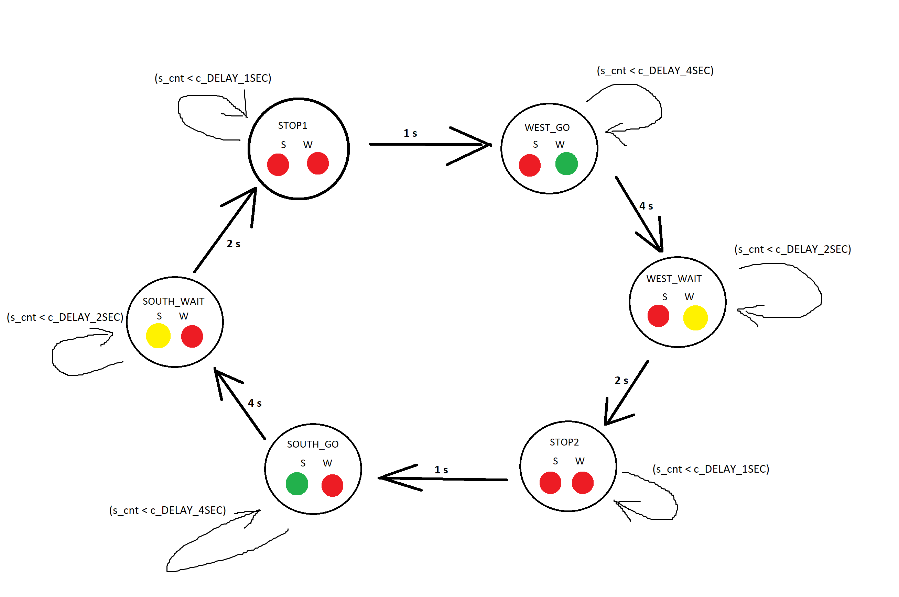

# Lab 8: Traffic Lights


GitHub link to my Digital-Electronics-1 repository

https://github.com/JiriKlimes99/Digital_Electronics_1.git

--------------------------------------------------


## Task 1 (Pre-Task)

Completed state table

| **Input P** | `0` | `0` | `1` | `1` | `0` | `1` | `0` | `1` | `1` | `1` | `1` | `0` | `0` | `1` | `1` | `1` |
| :-- | :-: | :-: | :-: | :-: | :-: | :-: | :-: | :-: | :-: | :-: | :-: | :-: | :-: | :-: | :-: | :-: |
| **Clock** |  |  |  |  |  |  |  |  |  |  |  |  |  |  |  |  |
| **State**   |  A  |  A  |  B  |  C  |  C  |  D  |  A  |  B  |  C  |  D  |  B  |  B  |  B  |  C  |  D  |  B  |
| **Output R** | `0` | `0` | `0` | `0` | `0` | `1` | `0` | `0` | `0` | `1` | `0` | `0` | `0` | `0` | `1` | `0` |


Figure with connection of RGB LEDs on Nexys A7 board


Completed table with color settings.

| **RGB LED** | **Artix-7 pin names** | **Red** | **Yellow** | **Green** |
| :-: | :-: | :-: | :-: | :-: |
| LD16 | N15, M16, R12 | `1,0,0` | `1,1,0` | `0,1,0` |
| LD17 | N16, R11, G14 | `1,0,0` | `1,1,0` | `0,1,0` |

--------------------------------------------------


## Task 2 - Traffic Light Controller

A) State diagram



B) Listing of VHDL code of sequential process p_traffic_fsm

```vhdl

p_traffic_fsm : process(clk)
    begin
        if rising_edge(clk) then
            if (reset = '1') then       -- Synchronous reset
                s_state <= STOP1 ;      -- Set initial state
                s_cnt   <= c_ZERO;      -- Clear all bits

            elsif (s_en = '1') then
                -- Every 250 ms, CASE checks the value of the s_state 
                -- variable and changes to the next state according 
                -- to the delay value.
                case s_state is

                    -- If the current state is STOP1, then wait 1 sec
                    -- and move to the next GO_WAIT state.
                    when STOP1 =>
                        -- Count up to c_DELAY_1SEC
                        if (s_cnt < c_DELAY_1SEC) then
                            s_cnt <= s_cnt + 1;
                        else
                            -- Move to the next state
                            s_state <= WEST_GO;
                            -- Reset local counter value
                            s_cnt   <= c_ZERO;
                        end if;

                    when WEST_GO =>
                        -- Count up to c_DELAY_4SEC
                        if (s_cnt < c_DELAY_4SEC) then
                            s_cnt <= s_cnt + 1;
                        else
                            -- Move to the next state
                            s_state <= WEST_WAIT;
                            -- Reset local counter value
                            s_cnt   <= c_ZERO;
                        end if;
                        
                    when WEST_WAIT =>
                        -- Count up to c_DELAY_2SEC
                        if (s_cnt < c_DELAY_2SEC) then
                            s_cnt <= s_cnt + 1;
                        else
                            -- Move to the next state
                            s_state <= STOP2;
                            -- Reset local counter value
                            s_cnt   <= c_ZERO;
                        end if; 
                    when STOP2 => 
                        -- Count up to c_DELAY_4SEC
                        if (s_cnt < c_DELAY_1SEC) then
                            s_cnt <= s_cnt + 1;
                        else
                            -- Move to the next state
                            s_state <= SOUTH_GO;
                            -- Reset local counter value
                            s_cnt   <= c_ZERO;
                        end if;
                    when SOUTH_GO =>
                        -- Count up to c_DELAY_4SEC
                        if (s_cnt < c_DELAY_4SEC) then
                            s_cnt <= s_cnt + 1;
                        else
                            -- Move to the next state
                            s_state <= SOUTH_WAIT;
                            -- Reset local counter value
                            s_cnt   <= c_ZERO;
                        end if;                    
                    when SOUTH_WAIT =>
                        -- Count up to c_DELAY_2SEC
                        if (s_cnt < c_DELAY_2SEC) then
                            s_cnt <= s_cnt + 1;
                        else
                            -- Move to the next state
                            s_state <= STOP1;
                            -- Reset local counter value
                            s_cnt   <= c_ZERO;
                        end if;                    
                        
                    -- It is a good programming practice to use the 
                    -- OTHERS clause, even if all CASE choices have 
                    -- been made. 
                    when others =>
                        s_state <= STOP1;

                end case;
            end if; -- Synchronous reset
        end if; -- Rising edge
    end process p_traffic_fsm;

```

C) Listing of VHDL code of combinatonial process p_output_fsm

```vhdl

 p_output_fsm : process(s_state)
    begin
        case s_state is
            when STOP1 =>
                south_o <= c_RED;
                west_o  <= c_RED;
            
            when WEST_GO =>
                south_o <= c_RED;
                west_o  <= c_GREEN;

                -- WRITE YOUR CODE HERE

            when WEST_WAIT =>
                south_o <= c_RED;
                west_o  <= c_YELLOW;
            
            when STOP2 =>
                south_o <= c_RED;
                west_o  <= c_RED;
            
            when SOUTH_GO =>
                south_o <= c_GREEN;
                west_o  <= c_RED;
                
            when SOUTH_WAIT =>
                south_o <= c_YELLOW;
                west_o  <= c_RED;                
                
            when others =>
                south_o <= c_RED;
                west_o  <= c_RED;
                
        end case;
    end process p_output_fsm;

```

D) Screenshot(s) of the simulation, from which it is clear that controller works correctly.


--------------------------------------------------


## Task 3 - Smart controller


A) State Table

| **Current state** | **Direction South** | **Direction West** | **Delay** | **Next State** |
| :-- | :-: | :-: | :-: | :-: |
| `STOP1`      | red    | red | 1 sec | for [i1,i2]=[0,1] => SOUTH_GO, for [i1,i2]=[0,0]or[1,1]or[1,0] => WEST_GO |
| `WEST_GO`    | red    | green | 4 sec | WEST_WAIT|
| `WEST_WAIT`  | red    | yellow | 2 sec | STOP2 	|
| `STOP2`      | red    | red | 1 sec | for [i1,i2]=[0,1] => WEST_GO, for [i1,i2]=[0,0]or[1,1]or[1,0] => SOUTH_GO |
| `SOUTH_GO`   | green  | red | 4 sec | SOUTH_WAIT |
| `SOUTH_WAIT` | yellow | red | 2 sec | STOP1 |


B) State Diagram


C) Listing of VHDL code of sequential process p_smart_traffic_fsm

Two inputs have been added:
input 1 = in_1
input 2 = in_2
They act as sensors, and are active in '1'.

These inputs determine, whether a car, or cars, are present at each of the roads.

```vhdl

    p_smart_traffic_fsm : process(clk)
    begin
        if rising_edge(clk) then
            if (reset = '1') then       -- Synchronous reset
                s_state <= STOP1 ;      -- Set initial state
                s_cnt   <= c_ZERO;      -- Clear all bits

            elsif (s_en = '1') then
                -- Every 250 ms, CASE checks the value of the s_state 
                -- variable and changes to the next state according 
                -- to the delay value.
                case s_state is

                    -- If the current state is STOP1, then wait 1 sec
                    -- and move to the next GO_WAIT state.
                    when STOP1 =>
                        -- Count up to c_DELAY_1SEC
                        if (s_cnt < c_DELAY_1SEC) then
                            s_cnt <= s_cnt + 1;
                        else
                            if (in_1 = '1' and in_2 = '0')then
                            s_state <= WEST_GO;
                            elsif (in_1 = '0' and in_2 = '1')then
                            s_state <= SOUTH_GO;
                            elsif (in_1 = '1' and in_2 = '1')then
                            s_state <= WEST_GO;
                            else
                            s_state <= WEST_GO;
                            end if;
                            -- Reset local counter value
                            s_cnt <= c_ZERO;
                        end if;

                    when WEST_GO =>
                        -- Count up to c_DELAY_4SEC
                        if (s_cnt < c_DELAY_4SEC) then
                            s_cnt <= s_cnt + 1;
                        else
                            -- Move to the next state
                            s_state <= WEST_WAIT;
                            -- Reset local counter value
                            s_cnt   <= c_ZERO;
                        end if;
                        
                    when WEST_WAIT =>
                        -- Count up to c_DELAY_2SEC
                        if (s_cnt < c_DELAY_2SEC) then
                            s_cnt <= s_cnt + 1;
                        else
                            -- Move to the next state
                            s_state <= STOP2;
                            -- Reset local counter value
                            s_cnt   <= c_ZERO;
                        end if; 
                        
                    when STOP2 => 
                        -- Count up to c_DELAY_4SEC
                        if (s_cnt < c_DELAY_1SEC) then
                            s_cnt <= s_cnt + 1;
                        else
                        -- Move to the next state
                        if (in_1 = '1' and in_2 = '0')then
                            s_state <= WEST_GO;
                        elsif (in_1 = '0' and in_2 = '1')then
                            s_state <= SOUTH_GO;
                        elsif (in_1 = '1' and in_2 = '1')then
                            s_state <= SOUTH_GO;
                        else
                            s_state <= SOUTH_GO;
                        end if;
                        -- Reset local counter value
                        s_cnt <= c_ZERO;
                        end if;
                        
                    when SOUTH_GO =>
                        -- Count up to c_DELAY_4SEC
                        if (s_cnt < c_DELAY_4SEC) then
                            s_cnt <= s_cnt + 1;
                        else
                            -- Move to the next state
                            s_state <= SOUTH_WAIT;
                            -- Reset local counter value
                            s_cnt   <= c_ZERO;
                        end if;                    
                    when SOUTH_WAIT =>
                        -- Count up to c_DELAY_2SEC
                        if (s_cnt < c_DELAY_2SEC) then
                            s_cnt <= s_cnt + 1;
                        else
                            -- Move to the next state
                            s_state <= STOP1;
                            -- Reset local counter value
                            s_cnt   <= c_ZERO;
                        end if;                    
                        
                    -- It is a good programming practice to use the 
                    -- OTHERS clause, even if all CASE choices have 
                    -- been made. 
                    when others =>
                        s_state <= STOP1;

                end case;
            end if; -- Synchronous reset
        end if; -- Rising edge
    end process p_smart_traffic_fsm;

```
